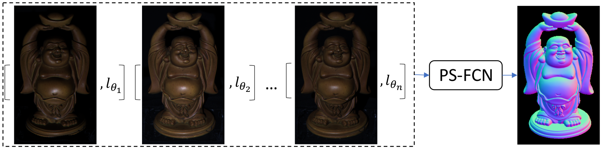
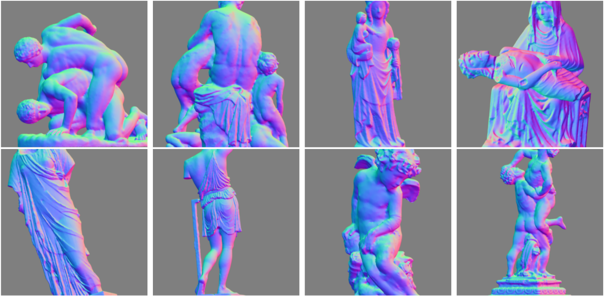

# PS-FCN
**[PS-FCN: A Flexible Learning Framework for Photometric Stereo, ECCV 2018](http://gychen.org/PS-FCN/)**,
<br>
[Guanying Chen](http://www.gychen.org), [Kai Han](http://www.hankai.org/), [Kwan-Yee K. Wong](http://i.cs.hku.hk/~kykwong/)
<br>

This paper addresses the problem of learning based photometric stereo for non-Lambertian surface.
<br>
<p align="center">
    
</p>

### _Changelog_
- July 27, 2019: We have already updated the code to support Python 3.7 + PyTorch 1.10. To run the previous version (Python 2.7 + PyTorch 0.40), please checkout to `python2.7` branch first (e.g., `git checkout python2.7`).


## Dependencies
PS-FCN is implemented in [PyTorch](https://pytorch.org/) and tested with Ubuntu 14.04, please install PyTorch first following the official instruction. 
- Python 3.7 
- PyTorch (version = 1.10)
- numpy
- scipy
- CUDA-9.0  

## Overview
We provide:
- Datasets: Blobby dataset (4.7 GB), Sculpture dataset (19 GB)
- Trained models (on both the Blobby dataset and the Sculpture dataset with a per-sample input number of 32):
    - PS-FCN for calibrated photometric stereo
    - UPS-FCN for uncalibrated photometric stereo
- Code to test on DiLiGenT main dataset
- Code to train a new model

## Testing
#### Download the trained models
```
sh scripts/download_pretrained_models.sh
```
If the above command is not working, please manually download the trained models from Google Drive ([PS-FCN and UPS-FCN](https://drive.google.com/drive/folders/1VxrPsV8Pg28JCcMZklW1LcBFm4crhK0F?usp=sharing)) and put them in `./data/models/`.

#### Test on the DiLiGenT main dataset
```shell
# Download DiLiGenT main dataset
sh scripts/prepare_diligent_dataset.sh

# Test PS-FCN on DiLiGenT main dataset using all of the 96 image-light pairs
CUDA_VISIBLE_DEVICES=0 python eval/run_model.py --retrain data/models/PS-FCN_B_S_32.pth.tar --in_img_num 96

# Test UPS-FCN on DiLiGenT main dataset only using images as input 
CUDA_VISIBLE_DEVICES=0 python eval/run_model.py --retrain data/models/UPS-FCN_B_S_32.pth.tar --in_img_num 96 --in_light
```

## Training
To train a new PS-FCN model, please follow the following steps:
#### Download the training data
```shell
# The total size of the zipped synthetic datasets is 4.7+19=23.7 GB 
# and it takes some times to download and unzip the datasets.
sh scripts/download_synthetic_datasets.sh
```
If the above command is not working, please manually download the training datasets from Google Drive ([PS Sculpture Dataset and PS Blobby Dataset](https://drive.google.com/drive/folders/1VxrPsV8Pg28JCcMZklW1LcBFm4crhK0F?usp=sharing)) and put them in `./data/datasets/`. 

#### Train PS-FCN and UPS-FCN
```shell
# Train PS-FCN on both synthetic datasets using 32 images-light pairs
CUDA_VISIBLE_DEVICES=0 python main.py --concat_data --in_img_num 32

# Train UPS-FCN on both synthetic datasets using 32 images
CUDA_VISIBLE_DEVICES=0 python main.py --concat_data --in_img_num 32 --in_light --item uncalib

# Please refer to options/base_opt.py and options/train_opt.py for more options

# You can find checkpoints and results in data/Training/
```

## FAQ

#### Q1: How to test PS-FCN on other dataset?
- You have to implement a customized Dataset class to load your data. Please refer to `datasets/DiLiGenT_data.py` for an example that loads the DiLiGenT main dataset. Precomputed results on DiLiGenT main/test dataset, Gourd\&Apple dataset, Light Stage Dataset and Synthetic Test dataset are available upon request.

#### Q2: Which eight sculpture shapes were used in rendering the training datasets? Why?
- Normal maps of the eight selected sculpture shapes are shown in the below figure (filenames can be found in this [link](images/sculpture_list.txt)). We chose these 8 shapes for their high quality meshes and complex geometry. Other complex 3D objects can also be used.
<p align="center">
    
</p>

#### Q3: What should I do if I have problem in running your code?
- Please create an issue if you encounter errors when trying to run the code. Please also feel free to submit a bug report.

#### Q4: Where can I download the Gourd&Apple dataset and Light Stage Data Gallery used in the paper?
- Gourd&Apple dataset is introduced in the paper [Photometric stereo with non-parametric and spatially-varying reflectance, Alldrin et al., CVPR 2008]. You may try to download this dataset from [Alldrin's homepage](http://vision.ucsd.edu/~nalldrin/research/). However, it seems that this link is not working now. You may send an email to the authors for this dataset. You can download the Light Stage Data Gallery from http://vgl.ict.usc.edu/Data/LightStage/. To test PS-FCN on these two datasets, please first preprocess and reorganize the images in a way similar to DiLiGent benchmark. 

## Citation
If you find this code or the provided data useful in your research, please consider cite: 
```
@inproceedings{chen2018ps,
  title={PS-FCN: A Flexible Learning Framework for Photometric Stereo},
  author={Chen, Guanying and Han, Kai and Wong, Kwan-Yee K.},
  booktitle={ECCV},
  year={2018}
}
```
